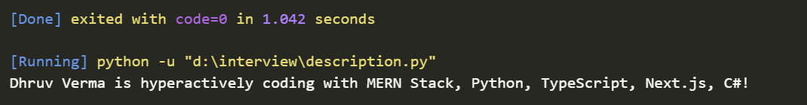
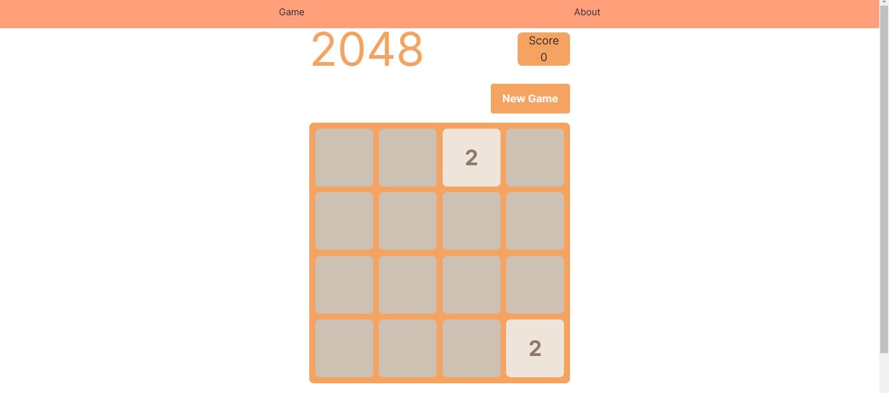

## Languages Used:

1. Javascript
2. Python

# This GIT involves my Interview Preparation Materials

1. BACKEND
2. DSA
3. FRONTEND
4. [Check out 2048 game](https://twoofoureightgame.vercel.app/)

   

## Study Material

[30 Second Of Interviews](https://30secondsofinterviews.org/)

[Rohan Paul](https://github.com/rohan-paul?tab=repositories)

[JavaScript Common Challenges Problems](https://github.com/rohan-paul/Javascript-Common-Challenges-Problems)

[LeetCode Python](https://github.com/wuduhren/leetcode-python/tree/master)

[Interview - Mission Peace](https://github.com/mission-peace/interview/tree/master)

[Placement Cell Application](https://github.com/Ayush-Kanduri/Placement-Cell-Application/tree/master)

[25 React Interview Projects](https://github.com/sangammukherjee/25-reactjs-interview-projects/tree/master)

[DSA Cheatsheet](https://onedrive.live.com/edit?action=editnew&id=C17FEB77BB469815!13139&resid=C17FEB77BB469815!13139&ithint=file%2cxlsx&ct=1708755073689&wdNewAndOpenCt=1708755073254&wdOrigin=OFFICECOM-WEB.START.NEW&wdPreviousSessionSrc=HarmonyWeb&wdPreviousSession=ddb66c44-cc96-481a-aa7b-63a6f13fcf6d&wdo=2&cid=c17feb77bb469815)

[Django Starter Docs](https://docs.djangoproject.com/en/4.2/intro/tutorial01/)

# Found some issue in the repo?

Create a new issue.
Please use a clear and descriptive title that summarizes the issue.
You can either contribute and resolve the issue yourself, or you can patiently await someone else to address it. It's important to note that simply opening a new issue is also appreciated and recognized.

Happy coding! 🚀
